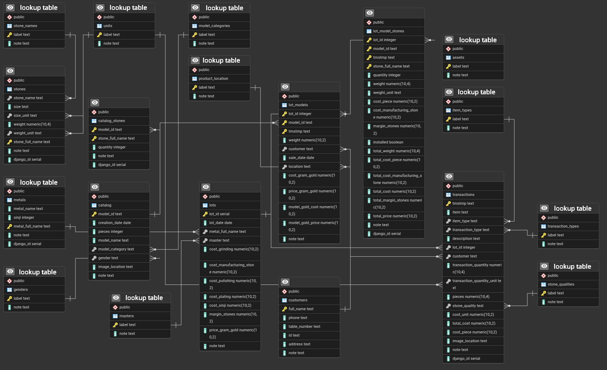

<h2 align="center">
  
   
  <b>Cauli Jewelry Management System</b>
</h2>

  <i>Unified ERP solution for jewelry manufacturing</i>

  
  
  
  

### 📖 Story

**Cauli** is a jewelry manufacturing company based in Tbilisi, Georgia.  
Previously, the owner relied on multiple Excel spreadsheets for calculations, management, analysis, accounting, stock tracking, sales, and other operations.  

This project replaces those spreadsheets with a single **web application** built on top of a PostgreSQL database.  

- Backend: **Django framework**  
- Database interaction: primarily via **Django ORM**, with occasional use of **SQLAlchemy** and **Pandas**  
- Database: **PostgreSQL**, enhanced with **custom views** and **trigger functions**  
- External tools: **Power BI**, **Grafana**, etc. for advanced analytics  
- Documentation: **Jupyter notebooks** combining executable code and explanations  

---

### 📷 DB ERP

  

---

### 📘 Instructions

- **Database setup:** see [`database.ipynb`](database.ipynb) for creating tables and views  
- **Django app setup & deployment:** see [`install.ipynb`](install.ipynb)  

---

### ⚙️ System Used

- **Server**:  
  - 8 GB RAM  
  - 12 GB SSD  
  - Intel® Core™ i3-12100 (12th Gen)  

- **Software stack**:  
  - OS: **Debian Linux**  
  - Web server: **Nginx**  
  - Database: **PostgreSQL**  
  - Framework: **Django**  

---
